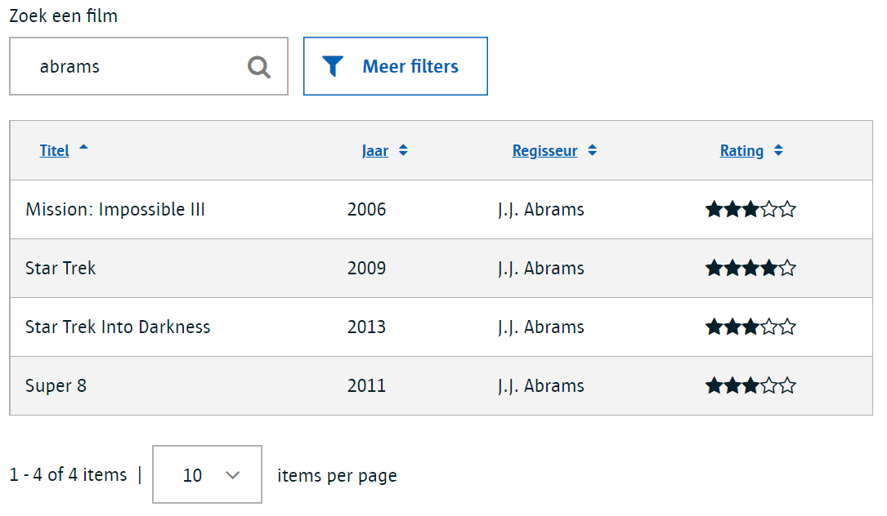

# Smart Table Widget (Angular)

This is the Angular 6+ UI for a Smart Widget implementing a table whose configuration is provided by the backend. When the corresponding API is implemented in the BFF, it provides automatic support for column types, filtering, pagination and sorting without additional client-side coding.



There is an example app, see below for instructions on running it.

## How to use

### Installing

```sh
> npm install @acpaas-ui-widgets/ngx-smart-table
```

### Using

A BFF service should be running on which the endpoints are configured (see the example app for how to provide such a BFF).

Prerequisite: set up [ACPaaS UI](https://github.com/digipolisantwerp/acpaas-ui_angular/) for your application.

Import the component in your module:

```ts
import { SmartTableModule } from '@acpaas-ui-widgets/ngx-smart-table';

@NgModule({
  imports: [
    ...,
    SmartTableModule
  ],
  ...
})
```

### In your template:

```html
<aui-smart-table
  apiUrl="/api/your-table-bff"
  (rowClicked)="onRowClicked($event)">
</aui-smart-table>
```

In the component code:

```ts
class YourComponent {

    onRowClicked(row) {
      // do something...
    }
}
```

Every value in the backing list must have a unique id.

### Supported attributes

- **apiUrl**: the URL of the back-end service feeding this widget
- **httpHeaders**: custom headers to provide to the server with every request
- **columnTypes**: custom column types, with special formatting or their own renderer component
- **configuration**: custom configuration that will be merged with the BFF configuration. This attributes overwrites BFF configuration.

Check the example application for how these are used.

### Events

- **rowClicked**: triggers when the user clicks on a row

### Protocol

The back-end service implements the following protocol:

- POST `/path/to/endpoint`
  - Fetch the rows, with the specified filtering and sorting.
- GET `/path/to/endpoint/config`
  - Fetch the smart table configuration.
- GET `/path/to/endpoint/search/all``
  - Fetch all data for excel export.

## Run the example app

```sh
> npm install
> npm start
```

Browse to [localhost:4200](http://localhost:4200)

## Contributing

We welcome your bug reports and pull requests.

Please see our [contribution guide](CONTRIBUTING.md).

## License

This project is published under the [MIT license](LICENSE).
